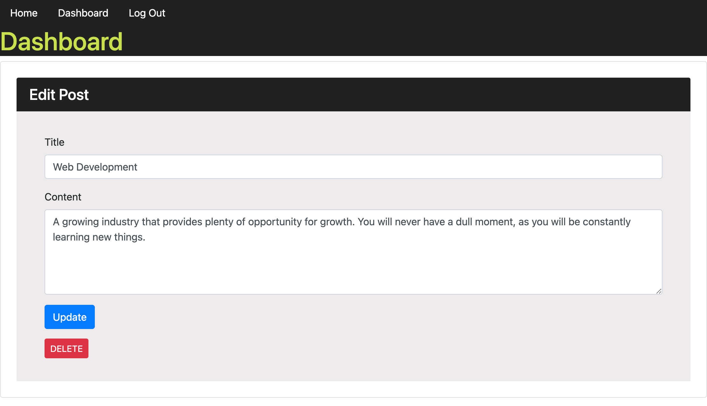
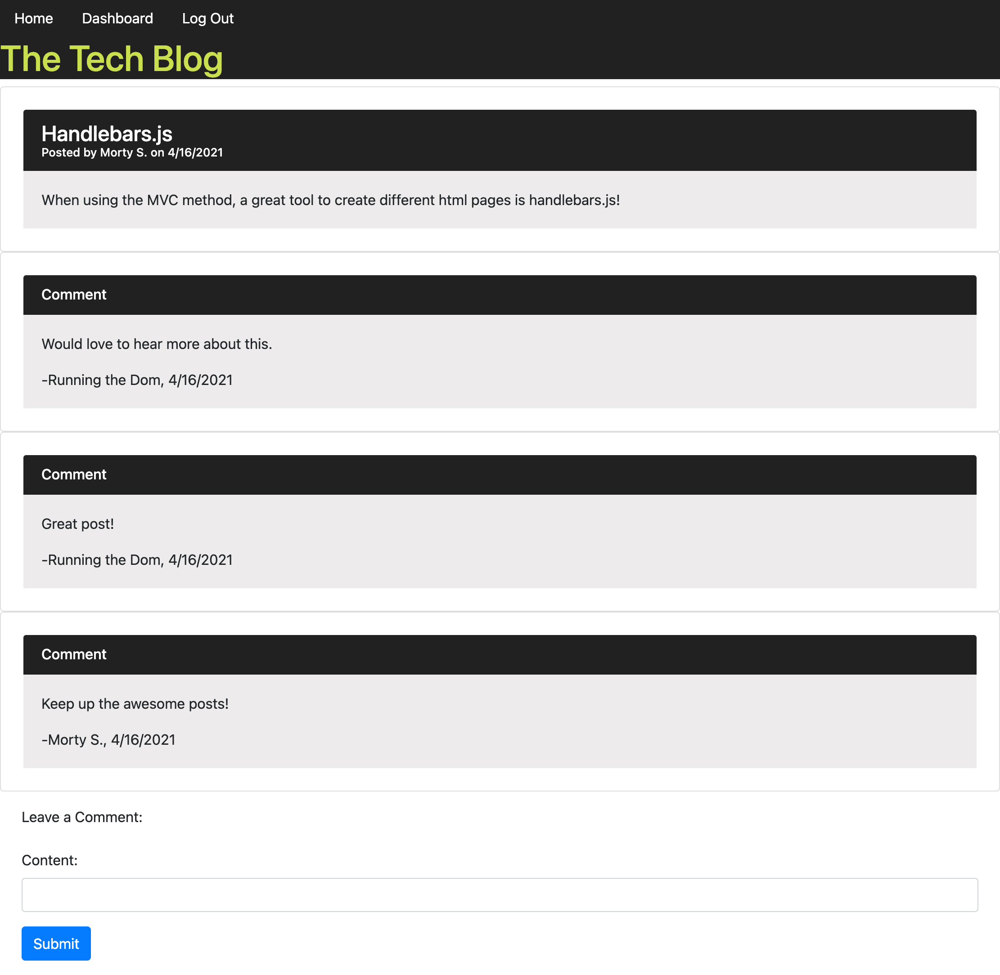

# MVC-Tech-Blog

## Description

This application allows users to share their thoughts and opinions on a social media platform, as well as comment on others posts.

This application is intended to initiate conversation over current tech. This conversation assists others in learning about new tech or enhancing their knowledge of existing tech.

Main challenges faced when creating this application was allowing individuals the ability to create comments on other posts and displaying these comments after being created. For future improvements, i would like to give the user the ability to delete a comment they have made on someones post and implementing a personal messaging system between users.

To view the live blog, click [here](https://frozen-caverns-37575.herokuapp.com/).

## Technologies Used

<ul>
<li>HTML</li>
<li>Bootstrap</li>
<li>CSS</li>
<li>JavaScript</li>
<li>MySQL 2</li>
<li>Sequelize</li>
<li>VS Code</li>
</ul>

## Installation

To install this repository for use, you will need to download all files in the [MVC Tech Blog](https://github.com/glchavez/MVC-Tech-Blog) repository. You will then need to run the schema.sql file within the db folder in MySQL to set the database.

Open your terminal and initialize your node models by running "npm i". Once this is done, then run "npm run seed" to populate your database with information. Last, run "npm run start" to initialize your local server.

Please note, you will need to updated the .env file with your MySQL credentials to run this application on your computer.

## Usage

As a user, you will start on the homepage that contains a list of postings by all users. To interact with the postings, you will need to login or sign-up by clicking on the "Login" link in the navbar.

Once logged in, you will be directed to your dashboard. This dashboard page gives you the ability to create a posting, view your current postings, or delete a posting. If you click a specific posting to view it, you will be able to edit the listing as well.

If you select a specific posting from the homepage when logged in, it will now show you the posting information and the ability to add a comment on the posting.

Please reference an image of the homepage, dashboard, edit post, and comment pages:

Homepage:

Dashboard:

Edit Post:

Comment:

## Credits

I would like to provide credit to [The Denver Univeristy Coding Bootcamp](https://bootcamp.du.edu/coding/) for providing me with the materials, intstructions, and one-on-one assistance to perform this project.

In addition, I would like to provide credit to [W3 Docs](https://www.w3docs.com/snippets/javascript/how-to-detect-idle-time-in-javascript.html) for providing me with information on how to detect idle time and logout a user if idle time limits have been reached.

## Contact Information

To contact me, please feel free to email me at giochavez320@gmail.com.

## License

MIT License

Copyright &copy; 2021 Giovany Chavez, Brice Huisken, Dominick Rafiti, Keith Black

Permission is hereby granted, free of charge, to any person obtaining a copy
of this software and associated documentation files (the "Software"), to deal
in the Software without restriction, including without limitation the rights
to use, copy, modify, merge, publish, distribute, sublicense, and/or sell
copies of the Software, and to permit persons to whom the Software is
furnished to do so, subject to the following conditions:

The above copyright notice and this permission notice shall be included in all
copies or substantial portions of the Software.

THE SOFTWARE IS PROVIDED "AS IS", WITHOUT WARRANTY OF ANY KIND, EXPRESS OR
IMPLIED, INCLUDING BUT NOT LIMITED TO THE WARRANTIES OF MERCHANTABILITY,
FITNESS FOR A PARTICULAR PURPOSE AND NONINFRINGEMENT. IN NO EVENT SHALL THE
AUTHORS OR COPYRIGHT HOLDERS BE LIABLE FOR ANY CLAIM, DAMAGES OR OTHER
LIABILITY, WHETHER IN AN ACTION OF CONTRACT, TORT OR OTHERWISE, ARISING FROM,
OUT OF OR IN CONNECTION WITH THE SOFTWARE OR THE USE OR OTHER DEALINGS IN THE
SOFTWARE.
